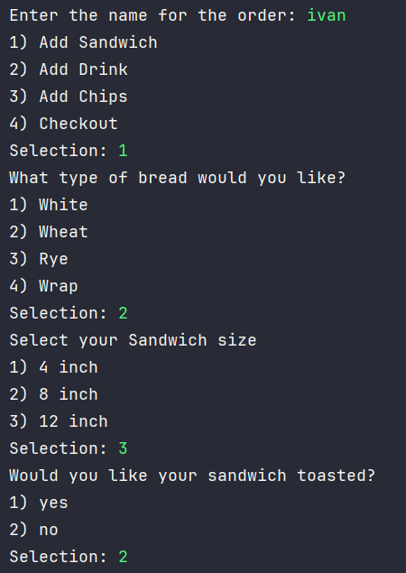
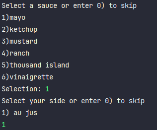

# Capstone 2: The Deli
Description: This project is a sandwich ordering system where customers can customize their sandwiches, drinks, and chips. 
Customers can choose from three sandwich sizes (4", 8", 12") and select from a variety of bread types (white, wheat, rye, or wrap). 
Sandwiches are fully customizable with a selection of regular and premium toppings, with premium toppings incurring an additional cost.
Customers can also choose to have their sandwich toasted. The system allows customers to place orders with one or more sandwiches, 
add drinks and chips, and view an itemized list of their order before finalizing. 
The application calculates and displays the total cost of the order, ensuring customers can verify their selections.

# Main menu Screen 

# Sandwich Creation 

This is the initial steps in creating a sandwich order, where the customer selects
the type of bread, the size of the sandwich, and if they want it toasted.

# Protein selection

Customer has the choice of adding protein, skipping the protein, and adding extra protein

# Cheese selection

Customer has the choice of adding cheese, skipping the cheese, and adding extra cheese

# Veggie Selection 

This is a loop that will continue to run until the customer enters 0, that way they 
can keep adding as many veggies as they like

# Sauce/Side selection

Customer can select a sauce for the sandwich, and select a side 

# Drink selection

# Chips selection

# Interesting Piece of Code

This code loops through all products and appends them to their unique string builder. 
This makes it so that if you have multiple sandwiches, drinks, or chips in one order, they will 
all be written to the file successfully

# Receipt File 

In this case I only have a sandwich with toppings, sauce, and a side

# Diagram

